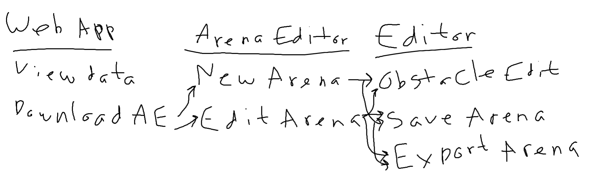

# seg4105_playground
Seg 4105
Lab 3 Submission

Ralf Pineda 
300111635

## High-level Description - Arena Editor

A dedicated 'Arena Editor' allows for the client to construct their own customized arena set-ups for more detailed experiments. The experiment participants will have arenas tailor made, allowing for specific things to be researched, such as the behaviour of participants when new obstacles are introduced. The Arena Editor allows for the client's research to be much more in-depth, better mirroring their experiments performed in real life. 

## Breadboarding 

