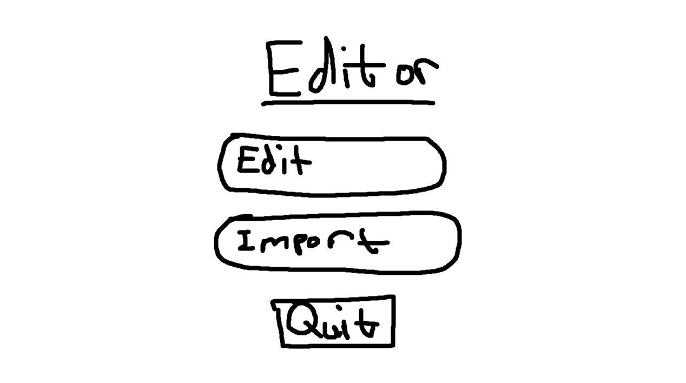
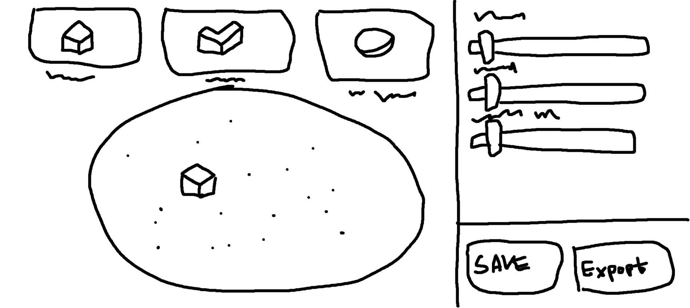
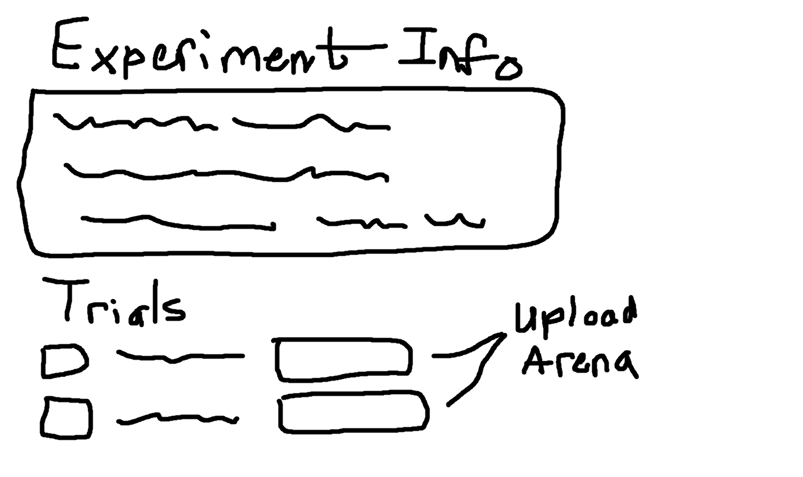
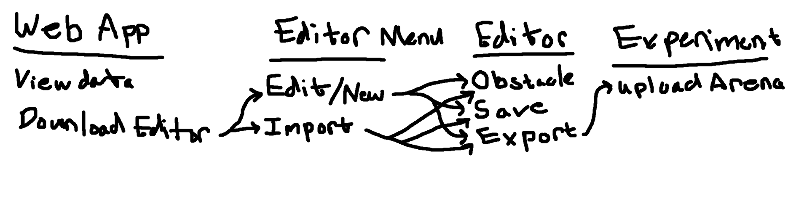

# seg4105_playground
Seg 4105
Lab 4 Submission

Ralf Pineda 
300111635

## Proposed Solution
The solution will be a stand-alone arena editor application, with supplemental changes to the front and backend to allow uploads and assignments of the created arenas.

From the main menu, the user will be able to edit saved arenas, import arenas, and quit the application.

The editor screen will have a simple interface, with buttons contained the obstacles being used to spawn in more obstacles. These obstacles will then be able to me moved around within the arena, with slider options for rotation and scale.

## Fat Marker Sketches

The client will be able to launch the arena editor from their local machine, first landing them at the main menu page. This page consists of a simple layout with three options: Edit Arenas, Imports Arenas, and Quit. The files will be saved and exported in a JSON format, allowing them to be easily uploaded with minimal storage costs.

The editor screen will have a simple interface, with buttons contained the obstacles being used to spawn in more obstacles. These obstacles will then be able to me moved around within the arena, with slider options for rotation and scale.

The front end will also need an update, with each experiment overview page having an area to upload arenas.

The flow for creating arenas and assigning them to experiments will be:
