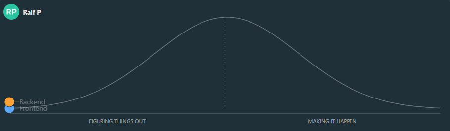
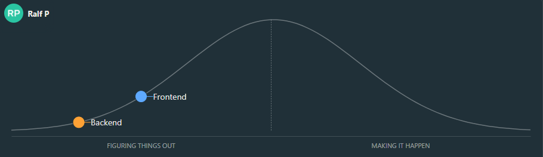
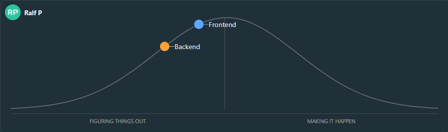
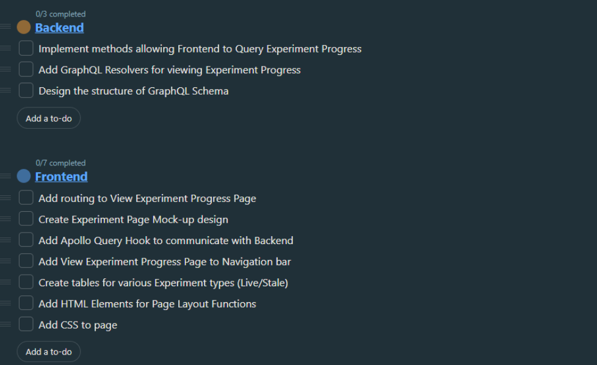

# seg4105_playground
Seg 4105
Lab 6 Submission

Ralf Pineda 
300111635

## Pitch Scopes

Backend - Creating the backend infrastructure and designs in order to allow for the user to see the Experiment Progress
Frontend - Implement the webpages and fields in order to see experiment progress information communicated from the backend

## Hill Charts

### Initial Hill Chart

### Progressed Hill Chart

After Progress is made in both frontend and backend scopes, the hill chart looks like this. The backend designing and infrastructure take longer to plan and implement, thus progress is slower

### Latest Hill Chart

After more design/preliminary tasks, progress in the tasks has moved the hill chart to the current state.

### Scopes/Tasks

The tasks associated with each Scope